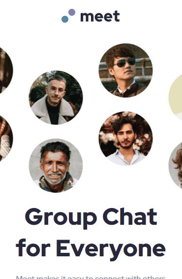
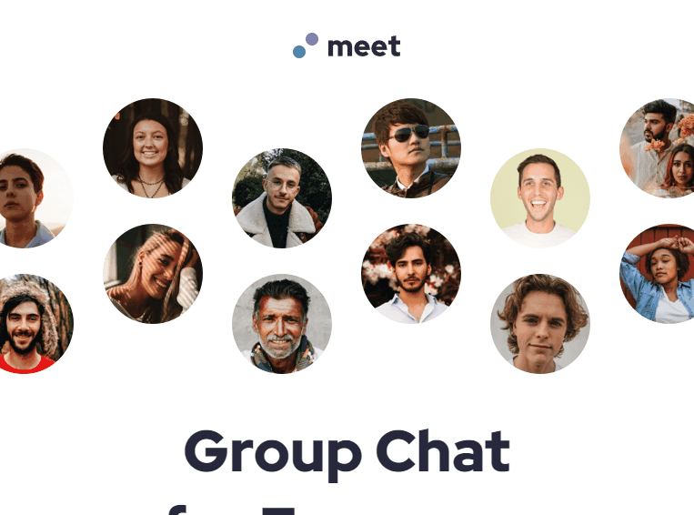

# Desafio Meet Landing Page - Frontend-Mentor

Este é um desafio de uma landing page para a Meet, proposto pelo site Frontend-Mentor.

## Tabela de Conteúdos

- [Visão Geral](#visão-geral)
    - [Imagens](#imagens)
    - [Link da página](#link)
- [Processo](#processo)
    - [Linguagens utilizadas](#linguagens-utilizadas)
    - [O que aprendi](#o-que-aprendi)
    - [Possíveis evoluções](#possíveis-evoluções)
- [Autor](#autor)

## Visão-geral

### Imagens

<br>

````
Versão de Desktop
````

   

<br>

````
Versão Mobile
````

 

<br>

````
Versão Tablet
````

 

### Link

- Página no GitHub Pages: <a href="https://julio-mansan2.github.io/meet-landing-page/">Clique aqui!</a>

## Processo

### Linguagens utilizadas

<br>

- Marcações semânticas de HTML5
- Propriedades de customização do CSS3

<br>

### O que aprendi

<br>

- Manipular dois backgrounds:


````css

.element {
    background: url(../images/desktop/image-hero-left.png) -5% center no-repeat, url(../images/desktop/image-hero-right.png) 105% 50% no-repeat;
}

````

<br>

### Possíveis evoluções

<br>

- Manipulação do background;
- Utilização do 'position:absolute'.

<br>

## Autor

GitHub - <a href="https://github.com/julio-mansan2">julio-mansan2</a> <br>
Front-end Mentor - <a href="https://www.frontendmentor.io/profile/julio-mansan2">julio-mansan2</a> <br>
LinkedIn - <a href="https://www.linkedin.com/in/j%C3%BAlio-a-mansan-3415a7249/">Júlio A.</a> <br>